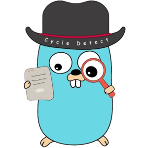

# Cycle-detect
[English](README.md) | Türkçe

___
## Motivasyon
Merhaba, ben Eray. Golang'i yeni öğrenen bir yazılım geliştiricisiyim. Benim için yeni bir dil olan Golang'e merak saldım. Ancak, bu süreçte sık sık karşılaştığım import cycle hataları, zamanla benim için bir sorun haline geldi. Özellikle uzun süre kod yazdıktan sonra bu hataları tespit etmek, geliştirdiğim projede kullanılan import ifadelerini izlemeyi zorlaştırıyordu.

Yaşadığım bu sıkıntıdan yola çıkarak düşündüm: Neden import cycle'ları doğrudan hangi dosyada olduğunu gösteren bir proje olmasın? Bu düşünceyle, insanların benzer sorunlarla karşılaşmasını engellemek ve daha etkili bir geliştirme süreci sunmak amacıyla bu projeyi oluşturdum. Bu sayede, import cycle hatalarını hızlı bir şekilde belirleyebilir ve çözebilir, geliştirme sürecini daha sorunsuz hale getirebiliriz.
___
## Başlangıç

Cycle detect, bir programın kaynak kodu içindeki import (ithalat) işlemlerinde oluşan döngüsel bağımlılıkları tespit etmeye yönelik bir işlemdir. Yani, bir modülün veya paketin, başka bir modülü doğrudan veya dolaylı olarak içe aktarması ve bu işlemin bir döngü oluşturması durumunu belirleyen bir analiz sürecidir. Cycle detect, kodun düzenlenmesi ve bakımı açısından önemli bir sorunu önceden belirleyerek yazılım geliştiricilere bu tür bağımlılıkları çözmeleri için rehberlik eder.

___
## Kurulum

###  `go install`

Go 1.20:

```bash
git clone https://github.com/eray-can/cycle-detect.git
```
___
# Kullanım

Kullanım oldukça basittir tek yapmanız gereken şey projeyi indirmek ve dosya yolunuzu tanımlayıp çalıştırmaktır. Aşağıda ki örneğe bakarak ilerleyebilirsiniz.


```
//Tek yapmanız gereken detect.toml dosyasından 'project_path' değişkenine ilgili golang projesinin dosya yolunu vermek
```
---


[Detect.toml](./detect.toml) detect.toml dosyasına buradan ulaşabilirsiniz

---
```go

func main() {

    engine := runner.NewEngine()
    engine.Run()
    defer engine.Close()

}

```
[Main](./main.go)  dosyasına buradan ulaşabilirsiniz
___


## İletişim

Eğer herhangi bir sorunuz, öneriniz veya geri bildiriminiz varsa lütfen benimle iletişime geçmekten çekinmeyin.

- E-posta: ceray6575@gmail.com
- Twitter: [@Eraynac13](https://twitter.com/Eraynac13)
- LinkedIn: [eraycan](https://www.linkedin.com/in/eraycan/)

Ayrıca, GitHub üzerinden de bana ulaşabilirsiniz. Issue açarak hataları rapor edebilir veya projeye katkıda bulunabilirsiniz.
